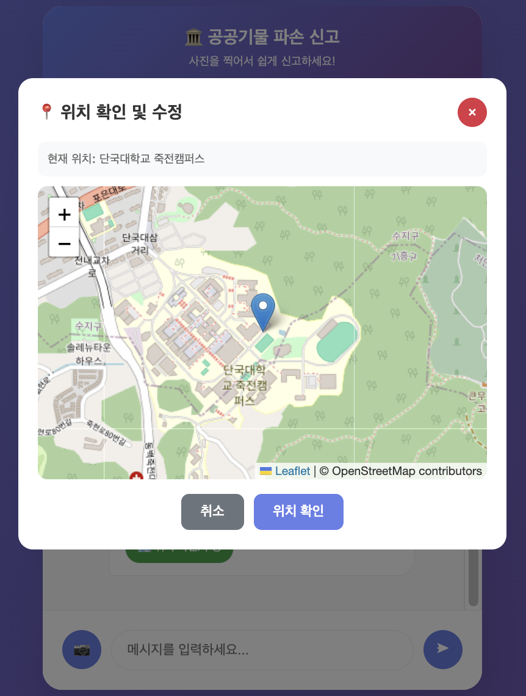
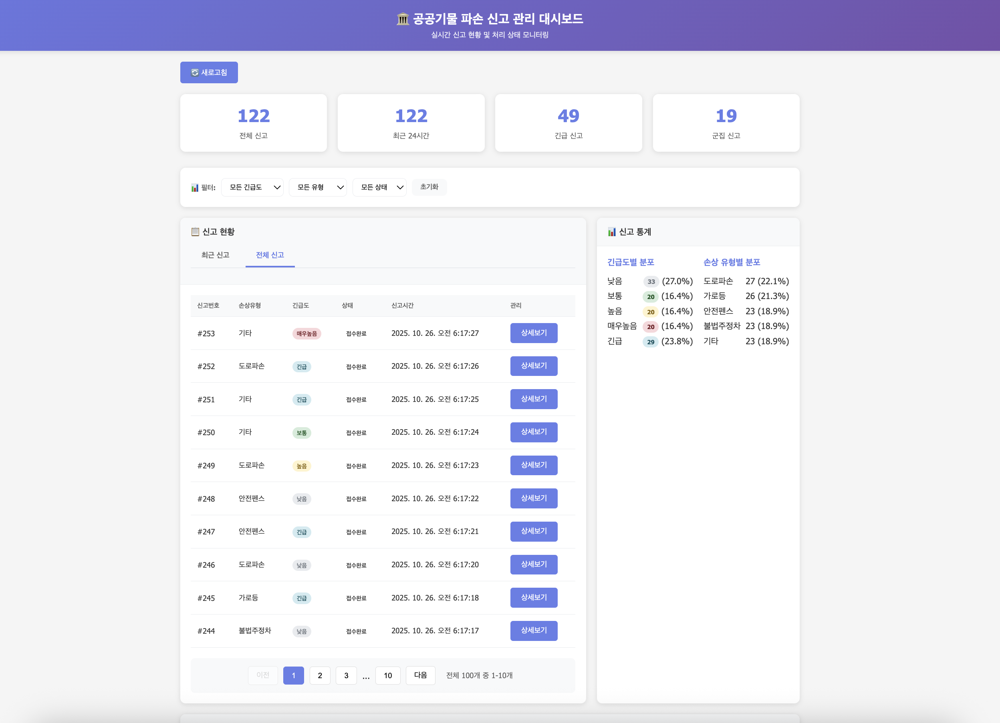
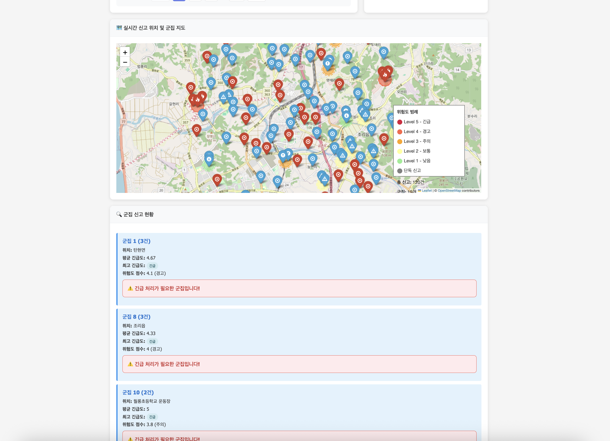
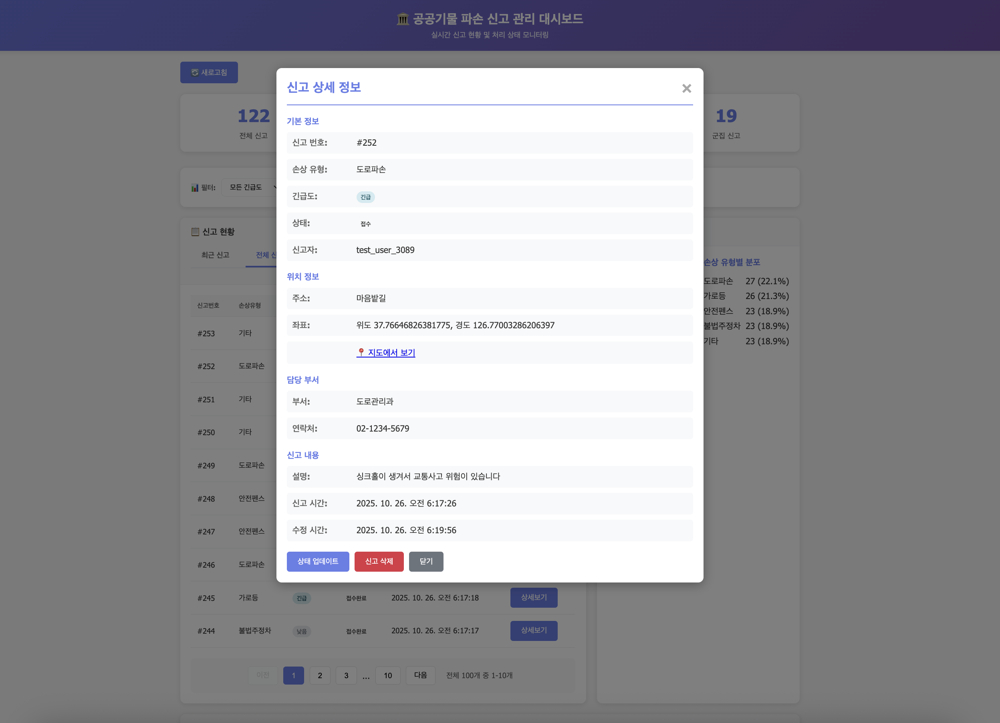
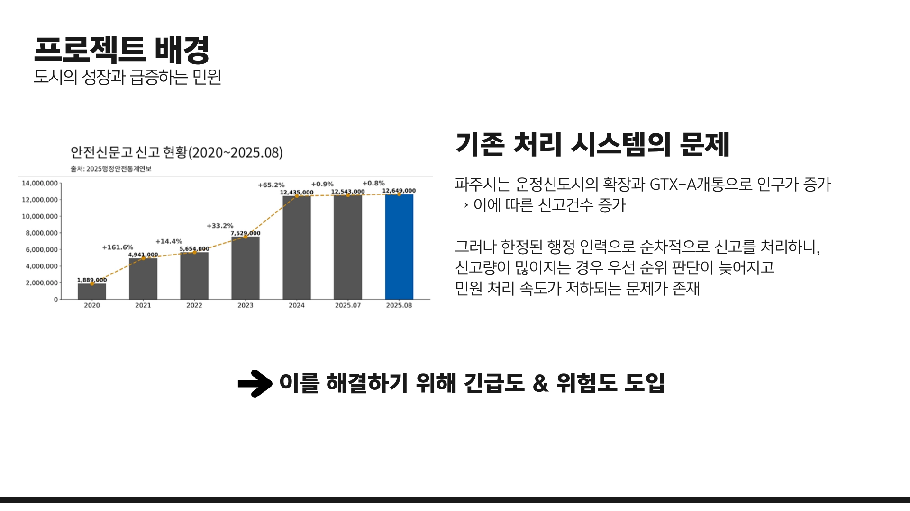
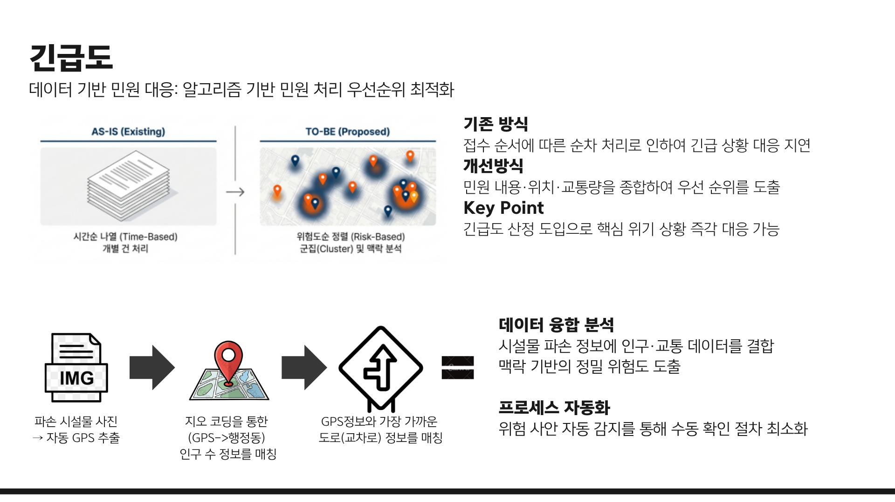
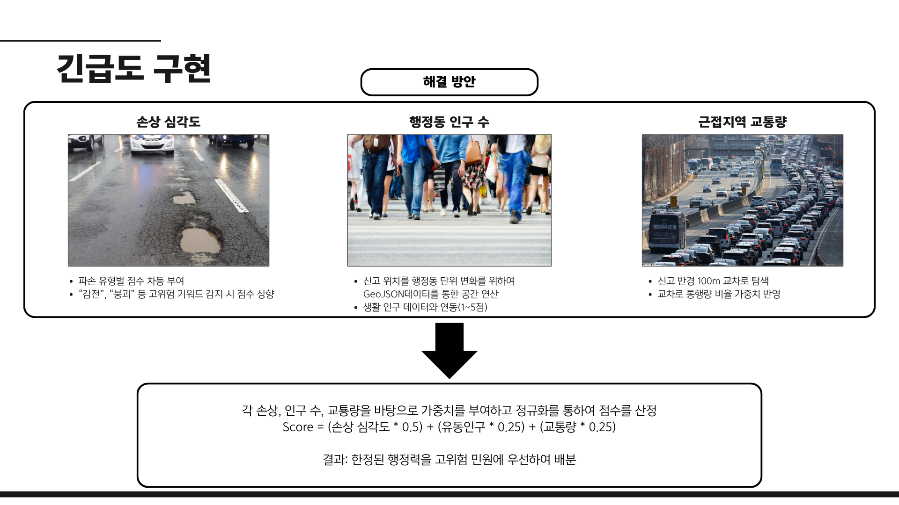
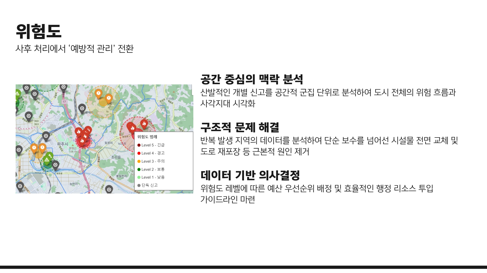

# 공공기물 파손 신고 시스템

## 프로젝트 개요
시민이 웹 인터페이스를 통해 공공기물 파손을 쉽게 신고할 수 있는 AI 기반 스마트 신고 시스템입니다.


### 해결하고자 하는 문제
- 가로등 파손, 도로 파손, 도로 안전 펜스 파손 시 신고의 번거로움
- 기존 신고 시스템의 낮은 사용성
- 민원센터 전화 신고의 불편함

### 개선 방안
- 웹 기반 채팅형 인터페이스를 통한 간편한 신고
- AI 객체 탐지로 자동 손상 유형 분류
- 위치 정보 자동 추출
- 부서별 자동 연계
- 실시간 처리 상태 업데이트

## 주요 기능

### AI 기반 기능
- 이미지 객체 탐지: Hugging Face YOLO 모델 사용
- 손상 유형 자동 분류: 가로등, 도로파손, 안전펜스, 불법주정차 등
- 긴급도 AI 판단: 텍스트 키워드 분석 기반 긴급도 계산 (1-5단계)
- 군집 신고 탐지: DBSCAN 알고리즘으로 동일 지역 다중 신고 탐지

### 사용자 기능
- 채팅형 UI: 카카오톡과 유사한 직관적인 인터페이스
- 사진 업로드: 클릭으로 간편 업로드
- 실시간 상태 확인: 신고 처리 과정 실시간 모니터링
- 손상 유형 선택: AI 추천 + 사용자 선택 옵션
- 지도 기능: 위치 확인 및 신고 현황 시각화
- EXIF 위치 추출: 사진에서 GPS 정보 자동 추출

### 관리자 기능
- 실시간 대시보드: 신고 현황 및 통계 모니터링
- 필터링 기능: 긴급도, 손상 유형, 상태별 필터링
- 페이지네이션: 신고 내역 10개씩 조회
- 상세보기: 개별 신고 상세 정보 조회 및 관리
- 상태 관리: 신고 상태 업데이트 (접수 → 검토중 → 처리중 → 완료)
- 신고 삭제: 신고 삭제 기능
- 군집 신고 관리: 동일 지역 다중 신고 우선 처리
- 긴급 알림 시스템: 긴급도 4-5단계 신고 즉시 알림
- 실시간 지도: 신고 위치 군집 시각화

## 스크린샷

### 사용자 인터페이스 (채팅형)
<div style="display: flex; flex-wrap: wrap; gap: 10px; margin-bottom: 20px;">
  
  
</div>
<div style="display: flex; flex-wrap: wrap; gap: 10px; margin-bottom: 20px;">
  
  
</div>

### 관리자 대시보드
<div style="display: flex; flex-wrap: wrap; gap: 15px; margin-bottom: 20px; justify-content: center;">
  
  
</div>

### 신고 상세보기
<div style="display: flex; flex-wrap: wrap; gap: 10px; margin-bottom: 20px;">
  
</div>

## 기술 스택

### Backend
- FastAPI: 고성능 비동기 웹 프레임워크
- Python 3.8+: 메인 개발 언어
- SQLite: 경량 데이터베이스

### AI/ML
- Hugging Face Transformers: 객체 탐지 모델 (YOLO)
- OpenCV: 이미지 처리
- scikit-learn: 군집 분석 (DBSCAN)
- PyTorch: 딥러닝 프레임워크
- PIL: 이미지 처리 및 EXIF 데이터 추출

### Frontend
- HTML5/CSS3/JavaScript: 반응형 웹 UI
- 카카오톡 스타일 디자인: 친숙한 사용자 경험
- Leaflet 지도: 위치 시각화

---

## 담당 역할: 긴급도 & 위험도 시스템 설계

팀 프로젝트에서 백엔드 로직 중 긴급도 산정과 위험도 분석 시스템을 설계하고 구현했습니다.
단순히 접수 순서대로 처리하던 기존 방식의 한계를 데이터 기반 우선순위 시스템으로 해결한 과정을 정리합니다.

### 1. 문제 인식: 급증하는 민원과 기존 시스템의 한계



파주시는 운정신도시 확장과 GTX-A 개통으로 인구가 급증하면서, 안전신문고 신고 건수가 2020년 약 189만 건에서 2024년 약 1,243만 건으로 증가했습니다. 기존 시스템은 한정된 행정 인력이 접수 순서대로 민원을 처리하는 구조였기 때문에, 신고량이 늘어날수록 우선순위 판단이 늦어지고 민원 처리 속도가 저하되는 문제가 있었습니다. 이를 해결하기 위해 긴급도와 위험도 개념을 도입했습니다.

### 2. 긴급도 설계: 시간순 처리에서 위험도순 처리로



기존 방식(AS-IS)은 접수 순서에 따른 순차 처리로, 긴급 상황에 대한 대응이 지연될 수밖에 없었습니다. 이를 개선하기 위해 민원 내용, 위치, 교통량을 종합하여 우선순위를 도출하는 방식(TO-BE)을 설계했습니다.

데이터 파이프라인은 다음과 같이 구성됩니다.
1. 파손 시설물 사진에서 GPS 좌표를 자동 추출
2. 지오코딩을 통해 GPS를 행정동 단위로 변환하고, 해당 행정동의 생활 인구 데이터를 매칭
3. GPS 좌표 반경 100m 내 교차로를 탐색하여 교통량 정보를 연동

이 과정을 통해 단순 텍스트 키워드 분석을 넘어, 시설물이 위치한 지역의 맥락까지 반영한 긴급도 산정이 가능해졌습니다.

### 3. 긴급도 구현: 다차원 가중 평균 모델



긴급도는 세 가지 요소를 가중 평균하여 산정합니다.

- 손상 심각도 (가중치 0.5): 파손 유형별 기본 점수를 부여하고, "감전", "붕괴" 등 고위험 키워드 감지 시 점수를 상향
- 행정동 인구 수 (가중치 0.25): 신고 위치를 GeoJSON 기반 공간 연산으로 행정동에 매칭한 뒤, 생활 인구 데이터와 연동하여 1~5점으로 변환
- 근접지역 교통량 (가중치 0.25): 신고 지점 반경 100m 내 교차로를 탐색하고, 해당 교차로의 통행량 비율을 가중치로 반영

`Score = (손상 심각도 × 0.5) + (유동인구 × 0.25) + (교통량 × 0.25)`

이를 통해 한정된 행정력을 고위험 민원에 우선 배분할 수 있는 정량적 기준을 마련했습니다.

### 4. 위험도: DBSCAN 기반 공간 군집 분석



개별 신고의 긴급도 산정에 더해, DBSCAN 알고리즘을 활용한 공간 군집 분석으로 도시 전체의 위험 흐름을 파악하는 위험도 시스템을 구현했습니다.

산발적인 개별 신고를 공간적 군집 단위로 분석하여 도시 전체의 위험 흐름과 사각지대를 시각화하고, 반복 발생 지역의 데이터를 분석하여 단순 보수를 넘어선 시설물 전면 교체, 도로 재포장 등 근본적 원인 제거를 위한 의사결정을 지원합니다.

파주시는 운정 신도시와 군사지역이 공존하는 복합 도시이기 때문에, 동일한 군집 기준(eps)을 적용하면 인구 밀도가 낮은 지역의 신고 군집은 생성 가능성이 낮아집니다. 이를 해결하기 위해 행정동별 생활 인구를 로그 스케일로 정규화하여, 고밀도 도심에서는 좁은 탐색 반경으로 정밀하게, 저밀도 외곽에서는 넓은 탐색 반경으로 권역 단위로 군집을 포착하는 동적 eps 로직을 적용했습니다.

---

## 프로젝트 구조

```
vandalism/
├── main.py                 # 메인 서버 (고급 기능 포함)
├── advanced_features.py    # AI 고급 기능 모듈
├── cluster.py              # 군집 분석 모듈
├── geocoding.py            # 지오코딩 모듈
├── requirements.txt        # Python 의존성
├── run.sh                 # 실행 스크립트
├── reports.db             # SQLite 데이터베이스
├── .gitignore             # Git 제외 파일 목록
├── static/                # 정적 파일
│   ├── index.html         # 기본 사용자 인터페이스
│   ├── index_with_map.html # 지도 기능 포함 인터페이스
│   └── admin.html         # 관리자 대시보드 (필터링, 페이지네이션, 상세보기)
├── uploads/               # 업로드된 이미지 저장 (Git 제외)
├── screenshots/           # 프로젝트 스크린샷 (직접 추가)
└── venv/                  # 가상환경 (Git 제외)
```

## 설치 및 실행

### 1. 저장소 클론
```bash
git clone <repository-url>
cd vandalism
```

### 2. 가상환경 설정
```bash
python3.10 -m venv venv
source venv/bin/activate  # Windows: venv\Scripts\activate
```

### 3. 의존성 설치
```bash
pip install -r requirements.txt
```

### 4. 서버 실행
```bash
# 방법 1: 실행 스크립트 사용
./run.sh
```
### 5. 접속
- 사용자 인터페이스: http://localhost:8000
- 관리자 대시보드: http://localhost:8000/admin
- API 문서: http://localhost:8000/docs

## API 엔드포인트

### 사용자 API
- `POST /api/upload` - 이미지 업로드 및 AI 분석
- `POST /api/report` - 신고 접수
- `GET /api/report/{report_id}` - 신고 상태 조회
- `GET /api/report/{report_id}/detail` - 신고 상세 정보 조회
- `GET /api/damage-types` - 손상 유형 목록

### 관리자 API
- `GET /api/reports?limit={limit}&offset={offset}` - 신고 목록 조회 (페이지네이션 지원)
- `GET /api/statistics` - 신고 통계
- `GET /api/clusters` - 군집 신고 현황
- `POST /api/report/{report_id}/status` - 신고 상태 업데이트
- `DELETE /api/report/{report_id}` - 신고 삭제
- `GET /api/map` - 군집 지도 데이터

## 차별화 포인트

### 1. AI 기반 자동화
- 객체 탐지: 사진만으로 손상 유형 자동 분류 (선택적)
- 긴급도 판단: 텍스트 키워드 분석으로 정확한 긴급도 계산
- 군집 탐지: 동일 지역 다중 신고 자동 탐지 및 우선 처리

### 2. 사용자 경험 최적화
- 카카오톡 스타일 UI: 친숙한 채팅 인터페이스
- 간편한 신고: 사진 업로드 → AI 분석 → 자동 신고
- 실시간 피드백: 처리 과정 실시간 업데이트

### 3. 관리 효율성
- 스마트 대시보드: 실시간 현황 모니터링
- 자동 우선순위: 긴급도 및 군집 기반 자동 우선순위 설정
- 예측 분석: 처리 시간 예측 및 리소스 최적화

## 시스템 아키텍처

```
사용자 → 웹 인터페이스 → FastAPI 서버 → AI 분석 엔진
                                    ↓
관리자 대시보드 ← SQLite DB ← 부서 연계 시스템
```


## 사용 방법

### 시민 (사용자)
1. http://localhost:8000 접속
2. 사진 업로드 또는 텍스트 입력
3. AI가 자동으로 손상 유형 분석
4. 손상 유형 확인 및 확인
5. 신고 완료

### 관리자
1. http://localhost:8000/admin 접속
2. 대시보드에서 전체 현황 확인
3. 필터로 원하는 신고만 조회
4. 페이지네이션으로 전체 내역 확인
5. 상세보기로 신고 관리